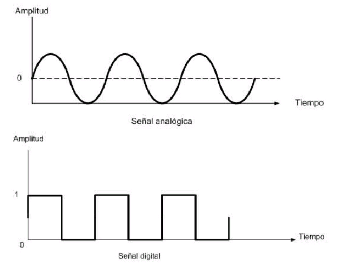
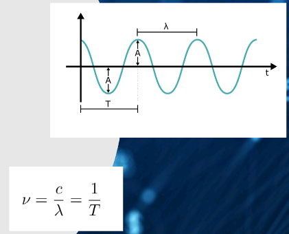
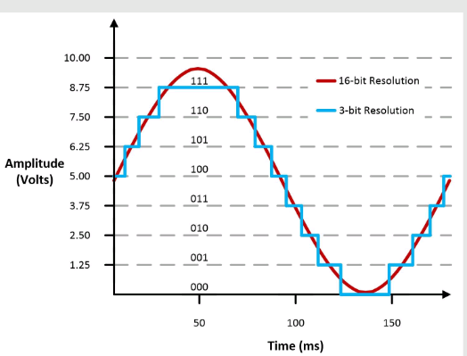
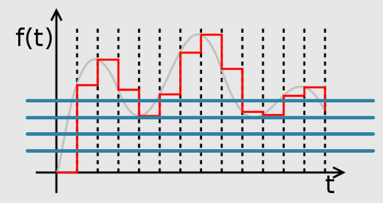
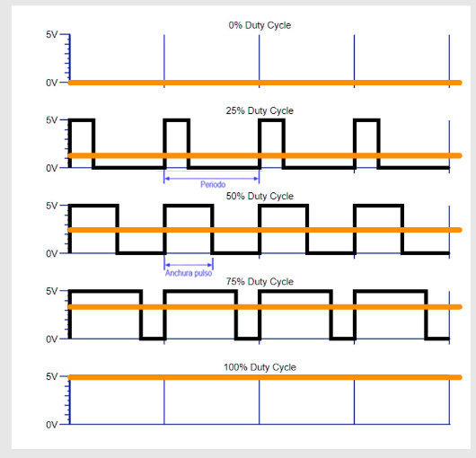
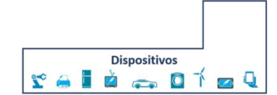
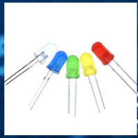
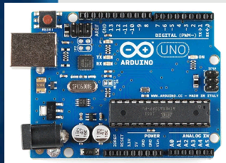
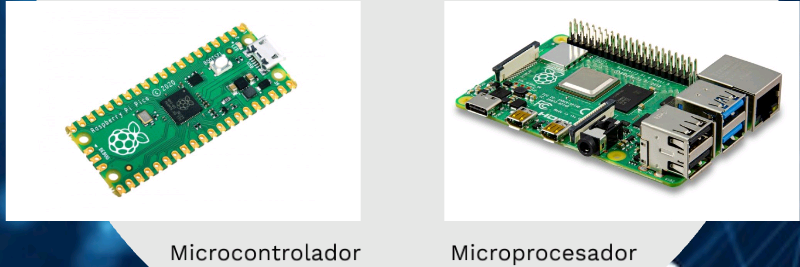

[<- Índice](../Internet%20of%20Things%20(IoT).md)

## Señales

#### ¿Qué tipo de señales se manejan en el Internet de las Cosas?

Tanto en el Internet de las cosas (IoT) como en la electrónica en general se utilizan 2 tipos de señales: ==Digital== y ==Analógica==

##### Señales analógicas

Señal contínua representada por una frecuencia, longitud de onda, periodo y amplitud.

- Periodo (T)
- Frecuencia (f, $\nu$)
- Longitud de onda ($\lambda$)
- Amplitud (A)

##### Señales digitales

Señal discreta cuantificada en ==bits==, por tanto, solo puede tener 2 estados posibles.

- 0, 1
- False, True
- LOW, HIGH

***Nota:***
- 0, 3.3 *V* (*ESP32*)
- 0, 5 *V* (*Arduino*)

##### Comparaciones y relaciones

| Analógicas                                                                           | Digitales                                                                                               |
| ------------------------------------------------------------------------------------ | ------------------------------------------------------------------------------------------------------- |
| ***Ventajas:*** - Señales de variables físicas - Señales puras (mayor calidad) | ***Ventajas:*** - Transmisión de datos eficiente - Inmunes al ruido - Almacenamiento eficiente |
| ***Desventajas:*** - Fallas en la transmisión de información - Degradación     | ***Desventajas:*** - Más inseguro - Programación                                                  |

##### Conversiones

¿Puedo convertir una señal digital a una analógica y viceversa?

###### ADC (Analogue to Digital Converter)

Convertir señales analógicas a señales digitales

- Bits
*Ejemplo:*
3 bits -> $2^3$ -> 8
16 bits -> $2^{16}$ -> 65536

###### DAC (Digital to Analogue Converter)

Convertir señales digitales a señales analógicas

###### PWM (Pulse Width Modulation)

Simular una señal analógica con el ancho de banda

## Dispositivos

Los dispositivos básicos que arman la primer capa de la arquitecutra IoT son 2:

- Transductores
- Controladores

#### Transductores

En su forma más básica, un transductor es un dispositivo que convierte un tipo de energía en otra. Existen 2 tipos de transuctores:

##### Sensores

Es un transductor que detecta cambios en su entorno generando fluctuaciones proporcionales a estos de la energía electrica inducida al dispositivo.

##### Actuadores

Al contrario de los sensores, estos son transuctores que en función de una señal electrica de entrada, generan una acción de alguna forma física de salida.

#### Controladores

Dispositivos que procesan las señales de entrada y ejecutan acciones en función de estas.

##### System on Chip (SoC)

Todos los componentes de un sistema electrónico (o de cómputo) está integrado en un chip.

##### Embedded system

Es un sistema de computación diseñado para realizar funciones específicas, y cuyos componentes se encuentran integrados en una placa base.

##### ¿Qué microcontroladores hay en IoT?

- Bits
- RAM
- Flash
- GPIO
- Interfaz de comunicación
- Consumo energético
- Costo
- Documentación

###### Node MCU ESP32 Dev Kit V1

###### Diferentes módulos

# Enlaces
[<- Anterior](Introduccion%20al%20Internet%20de%20las%20Cosas.md) | [Siguiente ->](Codigos%20de%20se%C3%B1ales%20digitales%20y%20analogicas.md)